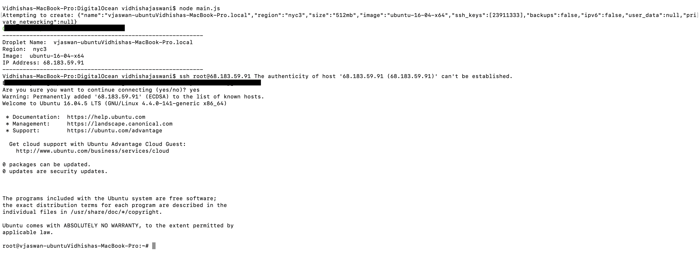
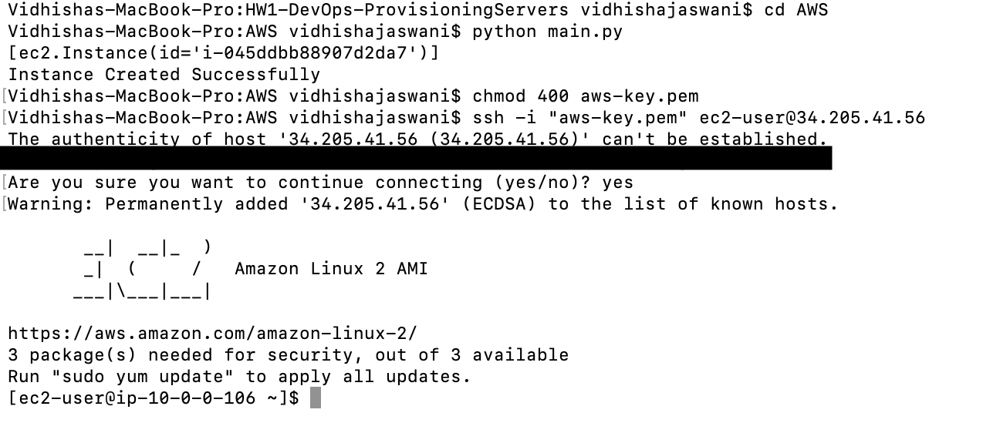

# HW1-DevOps: Provisioning Servers

Name: Vidhisha Jaswani Unity ID: vjaswan

## Digital Ocean

Documentation: [Digital Ocean](https://developers.digitalocean.com/documentation/v2/)

1. Create an account on Digital Ocean and generated a Personal Access Token (with both read and write access) to use
the API.

2. Set the token
```
# Mac/Linux
export DOTOKEN="xxx"
# Windows
setx DOTOKEN xxx
```
3. Create an SSH Key on your computer using ```ssh-keygen``` . This will generate keys in the location ```~/.ssh```
where id_rsa is the private key and id_rsa.pub is the public key. Press Enter when it asks to enter a paraphrase.

4. Next, In your Digital Ocean account, under Security add a SSH Key. Paste the content of id_rsa.pub as the SSH key
content and give the key a name.

5. Retrieve the ID associated with your SSH key using

```
curl -X GET -H 'Content-Type: application/json' -H "Authorization: Bearer $DOTOKEN" "https://api.digitalocean.com/v2/account/keys"
```

6. Update the code in createDroplet function from ```"ssh_keys":null``` to  ```"ssh_keys":[12345...]```
For the purpose of submission, I have removed my ID from the code.

7. Run the following commands
```
mkdir HW1-DevOps-ProvisioningServers
cd HW1-DevOps-ProvisioningServers
git clone https://github.ncsu.edu/vjaswan/HW1-DevOps-ProvisioningServers
cd HW1-DevOps-ProvisioningServers/DigitalOcean
npm install
node main.js
```

8. Now SSH into the droplet using the IP address and no password will be required. 
```
ssh root@<ip-address>
```



## AWS EC2 Instance

Documentation: [Amazon EC2](https://boto3.amazonaws.com/v1/documentation/api/latest/guide/ec2-examples.html)
Prerequisite: Python 3 version 3.3+

1. For creating and running the instance we need AWS CLI installed. Refer this [link](https://boto3.amazonaws.com/v1/documentation/api/latest/guide/ec2-examples.html) for installation.

1. Navigate to the folder where ```HW1-DevOps-ProvisioningServers/AWS``` and run ``` pip install -r requirements.txt ```

2. Run ``` aws configure ``` where it will ask you to enter your Access Key ID and Secret Access Key. To get these keys refer this [link](https://boto3.amazonaws.com/v1/documentation/api/latest/guide/ec2-examples.html)

3. Run command ```python main.py```. This will create an instance which you can also see in your dashboard.

4. Run the following commands to then SSH into the EC2 instance
``` 
chmod 400 aws-key.pem
ssh -i "aws-key.pem" ec2-user@<ip-address>
```



## Screencast
[Screencast Link]()

**Thank you!**
